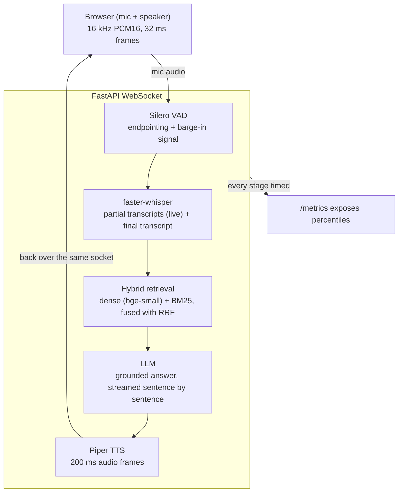

<p align="center">
  
</p>

# Real-Time Voice Assistant with Domain Grounding

Talk to it; it answers out loud from a document knowledge base. Streaming ASR → hybrid retrieval → grounded answer → streaming TTS, over a single WebSocket, with voice activity detection, live partial transcripts, and barge-in.

Runs entirely offline on CPU. No API key required.



---

## What I built vs. what I used

**Used (pretrained, off the shelf):** Whisper for ASR, Silero for VAD, Piper for TTS, BGE-small for embeddings. I did not train or fine-tune any of them.

**Built:** the streaming system around them — the VAD state machine and endpointing, the WebSocket protocol and its concurrency model, barge-in (including the part the obvious implementation gets wrong, below), sentence-level LLM→TTS pipelining, hybrid retrieval and grounding, the latency instrumentation, the evaluation harnesses, and the deployment.

---

## Measured results

All numbers below were produced by the harnesses in [eval/](eval) on the machine described under [Test machine](#test-machine). Nothing here is estimated.

### ASR accuracy — LibriSpeech test-clean

300 utterances (44 minutes of real human speech), int8 quantized, CPU.

| Model | WER | CER | Median decode | Real-time factor |
|---|---|---|---|---|
| tiny.en | 4.43% | 3.76% | 256 ms | 0.030× |
| **base.en** (default) | **3.30%** | **3.35%** | **466 ms** | **0.054×** |
| small.en | 2.71% | 3.27% | 1485 ms | 0.172× |

`small.en` buys 0.59 points of WER for 3.2× the decode time. In a conversation that trade is bad: the extra second of silence is more noticeable than the occasional misheard word, and the errors it fixes are mostly proper nouns, which the KB vocabulary hint (below) already helps with. **base.en** is the default for that reason.

Reproduce: `python -m eval.wer_eval --dataset librispeech --limit 300 --model base.en`

### Latency — per stage

Streaming path, measured client-side against a live server over six different spoken questions: wall clock from *the VAD detecting end of speech* to *the first byte of audio arriving at the client*. This is the pause a user actually sits through.

| Stage | Median |
|---|---|
| VAD, per 32 ms frame | 0.15 ms (215× faster than real time) |
| ASR queue wait | 0.0 ms |
| ASR (final transcript) | 447 ms |
| Retrieval (hybrid + RRF) | 5.9 ms |
| LLM (extractive backend) | 0.3 ms |
| TTS, to first audio frame | ~530 ms |
| **End of speech → first audio** | **981 ms** (range 876–1089, n = 6) |

ASR and TTS are 97% of it. Retrieval and the extractive backend are rounding errors — worth knowing before optimizing the wrong stage.

The batch endpoint (`/chat`, no streaming) is slower by construction, because it synthesizes the whole reply before returning anything: **1.22 s** median end to end (24 turns, `eval/latency_eval.py`).

Reproduce: `python -m eval.latency_eval --runs 4` and `python scripts/ws_probe.py`

### One optimization, before and after

Partial transcripts and the final transcript share a single Whisper model, so they contend for it. Partials were being launched on any frame classified as speech — including frames inside the end-of-utterance pause. The result: roughly one turn in two had a partial still decoding when the endpoint fired, and the answer queued behind it.

The fix is one condition — never start a partial once the user has stopped making sound, so any partial in flight has the full 600 ms hangover to finish in.

A/B on a fixed question, six turns each, everything else identical:

| | Median response latency |
|---|---|
| Before | 1379 ms |
| After | **1142 ms** |

−237 ms (−17%), and `asr_queue` reads 0.0 ms on every turn afterwards. (The 981 ms headline above is the same build measured across six *different* questions, which are shorter on average than this one — hence the lower figure. The A/B holds the question fixed so the comparison means something.)

The `asr_queue` stage exists in the metrics table specifically so this class of problem cannot hide inside an inflated ASR number. It was found by noticing that the reported stages summed to ~250 ms less than the latency the client observed.

That was not the end of it. The same build in a CPU-limited container showed `asr_queue` back at **856 ms**: partial decodes there take longer than the 600 ms hangover, so avoiding the pause is not enough — the decode simply cannot finish in time. The condition is therefore adaptive rather than a constant tuned on a fast laptop. The server measures what a partial actually costs on the machine it is running on and stops starting them when that exceeds 80% of the hangover, since partials are a nicety and the final transcript is the product. In the container that restored `asr_queue` to 0.0 ms while still delivering live partials, at 846–939 ms end to end.

---

## Three things that were not obvious

**1. Silero VAD silently returns nothing without a context window.** The ONNX graph needs the last 64 samples of the previous window prepended to the current one (576 samples, not 512). Its input dimension is dynamic, so feeding a bare 512-sample window raises no error — it just returns near-zero probability for everything, and the assistant never hears you. Measured on clear speech: mean p = 0.002 without the context, **0.970** with it. ([app/vad.py](app/vad.py))

**2. Cancelling the generator does not implement barge-in.** TTS runs ~8× faster than real time, so the server finishes *sending* a reply long before the user finishes *hearing* it. By the time someone talks over the assistant there is usually nothing left to cancel and several seconds of audio are still queued in the browser. The server has to track how much audio it sent and when, infer that playback is probably still going, and tell the client to flush its own queue. ([app/server.py](app/server.py), `barge_in`)

**3. Splitting text into sentences before TTS buys nothing on its own.** Piper's `synthesize()` already yields audio sentence by sentence — first frame at ~76 ms whether the text is passed whole or pre-split. The sentence-level pipeline earns its place by overlapping TTS with a *slow* generator (a hosted LLM streaming tokens over a network), not by making Piper faster. The test asserts that property against a deliberately slow backend rather than racing two similar TTS calls.

---

## Quick start

```bash
python -m venv .venv && .venv/Scripts/activate      # Linux/macOS: source .venv/bin/activate
pip install -r requirements.txt
python scripts/download_models.py                    # Silero VAD + Piper voice, ~65 MB
uvicorn app.server:app --port 8000
```

Open http://localhost:8000, click **Start**, and talk. Startup takes ~9 s before the server reports healthy: it ingests the knowledge base and warms every model first, because ONNX Runtime's first inference costs ~7.7 s for Piper alone and no user should pay that on their first question.

**Use headphones, or leave `echoCancellation` on.** Without one or the other the mic hears the assistant through the speakers, the VAD fires, and it interrupts itself in a loop.

Docker:

```bash
docker compose up --build        # app on :8000, Qdrant on :6333
```

The image is **1.55 GB** and every model is baked in, so a cold container is healthy in ~20 s and downloads nothing on its first request. Verified: built, run, and driven through both a batch turn and a streaming turn (846–939 ms end to end).

### Other entry points

```bash
# Batch turn: audio file in, spoken answer out.
# No recording handy? Make one: python scripts/make_sample.py "how much is the gigabit plan"
curl -F file=@data/samples/question.wav http://localhost:8000/chat/wav -o answer.wav

# Watch the streaming protocol without a browser (also tests barge-in)
python scripts/ws_probe.py --barge-in

# Live latency percentiles
curl "http://localhost:8000/metrics?format=markdown"
```

---

## Configuration

Everything is in [app/config.py](app/config.py) and overridable by environment variable or `.env` (see [.env.example](.env.example)).

| Setting | Default | Notes |
|---|---|---|
| `LLM_BACKEND` | `extractive` | `extractive` \| `gemini` \| `ollama` |
| `ASR_MODEL_SIZE` | `base.en` | see the WER table |
| `QDRANT_URL` | `:memory:` | or `http://localhost:6333` to persist |
| `VAD_MIN_SILENCE_MS` | `600` | end-of-utterance hangover; raise if it cuts you off |
| `GEMINI_MODEL` | `gemini-3.5-flash-lite` | see the Gemini notes below |
| `GEMINI_THINKING_BUDGET` | `0` | 0 disables thinking (halves latency); -1 model default |
| `CONVERSATION_MEMORY_TURNS` | `3` | follow-up context per session; 0 disables |
| `DEBUG_RETRIEVAL` | `false` | log transcript + retrieved chunks per query |
| `TTS_LENGTH_SCALE` | `1.0` | `<1` speaks faster |

### Diagnosing a wrong answer

A wrong spoken answer has three causes that are indistinguishable from the outside: ASR misheard the question, retrieval missed the passage, or the model ignored a passage it was given. `DEBUG_RETRIEVAL=true` prints all three inputs per turn:

```
[retrieval] transcript: 'my router light is blinking amber'
  1. rrf=1.0000  troubleshooting.md  ## No connection at all First, check whether the router...
  2. rrf=0.5833  troubleshooting.md  Faults can be reported in the account portal or by calling...
  3. rrf=0.5333  troubleshooting.md  Run a speed test from a device connected by ethernet cable...
```

Read it top down. If the transcript is wrong, it is an ASR problem — try `ASR_MODEL_SIZE=small.en`. If the transcript is right but the passage you expected is absent, it is retrieval — check chunking and the KB wording. If the right passage is sitting at rank 1 and the answer still ignored it, it is generation — switch backend or adjust the prompt.

Scores are Reciprocal Rank Fusion scores, not similarities: comparable *within* a query, meaningless as an absolute threshold across queries. A query the KB cannot answer shows up as a flat, low spread (the out-of-domain "what is the capital of France" tops out at 0.5000 here) rather than as a zero.

### The three LLM backends

`extractive` is the default so that the pipeline, the tests, and the latency numbers all run with no API key, no network, and no variance between runs. It ranks sentences from the retrieved passages and returns the best one or two verbatim. It therefore cannot hallucinate — every word it says came from the knowledge base — and it cannot paraphrase, combine two facts, or answer anything the KB does not state almost literally.

Its failure mode is lexical. Asked *"what are your support hours"* it answers *"Emergency outage support runs 24 hours a day"*, because that sentence contains both "support" and "hours" while the correct one ("Phone and chat support run from 7 a.m. to 11 p.m.") contains neither word in the queried form.

**`gemini` fixes exactly that.** Same question, same retrieved context, live:
> Phone and chat support are available from seven a.m. to eleven p.m. local time, seven days a week, and emergency outage support is available twenty-four hours a day.

It also still refuses out-of-KB questions ("I do not have that information"), so grounding survives the upgrade. Setup:

```bash
pip install -r requirements-llm.txt
echo "LLM_BACKEND=gemini"      >> .env
echo "GEMINI_API_KEY=your-key" >> .env      # .env is gitignored
```

Two things about Gemini that cost real latency and are handled in code:

- **Model naming moved on.** `gemini-2.0-flash` is shut down, and `gemini-2.5-flash` now returns 404 for new keys — *"no longer available to new users"*. The default is `gemini-3.5-flash-lite`; `GEMINI_MODEL` changes it without touching code.
- **Thinking is on by default and doubles latency.** Measured time-to-first-token on the free tier: `gemini-3.5-flash` 2390 ms with thinking, **850 ms** with `thinking_budget=0`; `gemini-3.5-flash-lite` **730 ms**; `gemini-3.6-flash` 2860 ms. There is nothing to reason about when reading one sentence out of retrieved context, so `GEMINI_THINKING_BUDGET` defaults to 0. Models that reject the parameter (3.6-flash, 3.5-flash-lite) are detected on first use and retried without it, once per process.

Free-tier Gemini has a low requests-per-minute ceiling, so **a 429 mid-conversation is expected, not exceptional**. Any hosted-backend failure — rate limit, DNS, timeout — degrades that single turn to the extractive backend and logs why; the WebSocket session survives. If tokens were already being spoken when the failure hit, the turn is truncated rather than restarted, because substituting a different answer would have the assistant contradict itself mid-sentence.

Budget roughly **+0.7–0.9 s** on top of the ~1 s local pipeline when using Gemini. The hosted call is then the largest single stage.

### Conversation memory

Spoken follow-ups are short and referential, so each turn carries the last `CONVERSATION_MEMORY_TURNS` exchanges (default 3) into the next prompt. Live, with `gemini-3.5-flash-lite`:

| | *"tell me about the starter plan"* → *"how much is it"* |
|---|---|
| Memory on | "The Starter plan costs thirty dollars a month." |
| Memory off | "I do not have that information." |

Three properties worth knowing:

- **Memory is per WebSocket session**, held on the `Session` object, never at module scope — two simultaneous callers cannot see each other's turns. Closing the socket forgets everything; so does the protocol's `{"type": "reset"}`.
- **It is bounded** by a `deque(maxlen=N)`, so a long conversation cannot grow the prompt without limit. Each stored turn is also length-capped.
- **History is framed as reference-resolution only**, not as a source of facts. Without that instruction the model starts treating its own earlier answers as evidence and re-asserts facts that have since dropped out of the retrieved context — which is precisely the grounding failure the retrieval layer exists to prevent.

Known limitation: memory reaches the **LLM only**. Retrieval still runs on the raw utterance, so *"how much is it"* retrieves on those four words. It works above because the KB is small enough that the right chunk is still in the top-k; on a larger corpus the retrieval step would need the same treatment (query rewriting from history), which is not implemented here. The extractive backend ignores history entirely — resolving "it" needs a language model.

---

## Design notes

**Torch-free by construction.** faster-whisper runs on CTranslate2; Silero VAD, Piper, and the embedding models run on ONNX Runtime. Nothing in the stack needs PyTorch, which keeps the image near 2 GB instead of ~6 GB and cuts cold start substantially. This is why the code talks to Silero's ONNX graph directly instead of using the `silero-vad` package, which pulls in torch + torchaudio (~2.5 GB) to wrap a 2 MB file, and why embeddings come from `fastembed` rather than `sentence-transformers`.

**Retrieval is hybrid.** Voice queries arrive through ASR, so they carry transcription noise and conversational phrasing while the KB is written in documentation register. Dense embeddings bridge that paraphrase gap; BM25 catches the exact identifiers — plan names, policy names — that dense vectors blur. Reciprocal Rank Fusion merges the two rankings without needing a calibrated score mapping between them.

**Grounding starts at ASR, not at the LLM.** The KB's proper nouns are extracted and passed to Whisper as an `initial_prompt`. If ASR writes "a roar of bank" for "Aurora Bank", no amount of retrieval quality recovers that turn. The worst LibriSpeech utterances in the eval above are all proper nouns, which is the same failure in the open domain.

**Receiving and responding are separate tasks.** If the socket loop blocked while a reply was being spoken, the server would be deaf during exactly the window in which a user is most likely to interrupt. Model calls are blocking C extensions, so they run in the executor and the response thread checks a cancel flag between audio frames — which bounds barge-in reaction to one frame (~200 ms).

---

## Testing

```bash
pytest tests/ -v          # 56 tests, ~20 s
ruff check app eval tests scripts
```

The suite covers the parts that are wrong in a naive implementation rather than the parts that are easy to assert: that the VAD ignores room tone but not speech, that it does not split one sentence at its internal pauses, that segmentation is identical whether audio arrives in 100-sample or 5000-sample chunks, that a hard-wrapped markdown sentence is not truncated mid-answer, that the extractive backend never emits a word absent from its context, and that barge-in fires when the server has already finished sending but the client is still playing.

CI ([.github/workflows/ci.yml](.github/workflows/ci.yml)) lints, runs the suite, gates on a synthetic-speech WER threshold, builds the image, and health-checks the container. The synthetic gate is a regression check, not an accuracy claim — TTS speech is unrealistically clean, and the honest accuracy number is the LibriSpeech one.

---

## Limitations

- **CPU latency floor.** ~1 s from end of speech to first audio. ASR and TTS are ~97% of it. A GPU or a smaller distilled ASR model is the next real win; there is little left to shave in the orchestration.
- **The default answer backend is extractive**, with the lexical failure mode shown above. Use Gemini or Ollama for answer quality.
- **Accent and noise robustness are untested.** LibriSpeech test-clean is read speech from a quiet room. Expect materially worse WER on accented, noisy, or telephone audio. Reporting a number for that would require a test set I do not have.
- **Barge-in depends on echo cancellation.** No server-side AEC; the browser's `echoCancellation` or headphones do that job.
- **Whisper is not a streaming model.** Partial transcripts are re-decodes of the growing buffer, so earlier words can be rewritten as more audio arrives. Only the endpointed final transcript drives an answer.
- **One worker.** Each worker loads its own copy of every model, and a WebSocket session is pinned to the worker that accepted it. Scaling means more containers, not more workers.

## Test machine

Windows 11, Python 3.13, CPU only (no CUDA). All models int8/ONNX. Numbers on a GPU or a different CPU will differ; rerun the harnesses rather than quoting these.

## Knowledge base

[data/kb/](data/kb) contains support documents for "Meridian Broadband", a fictional ISP invented for this demo. Drop your own `.md` or `.txt` files in and restart to re-index.
